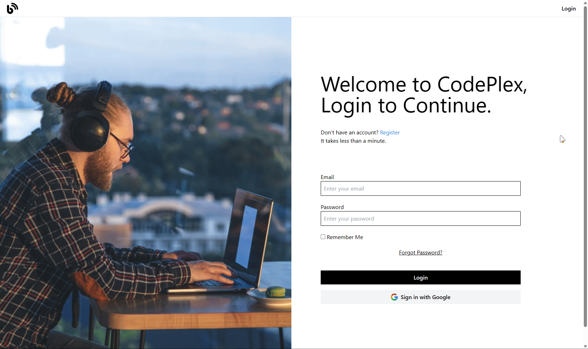
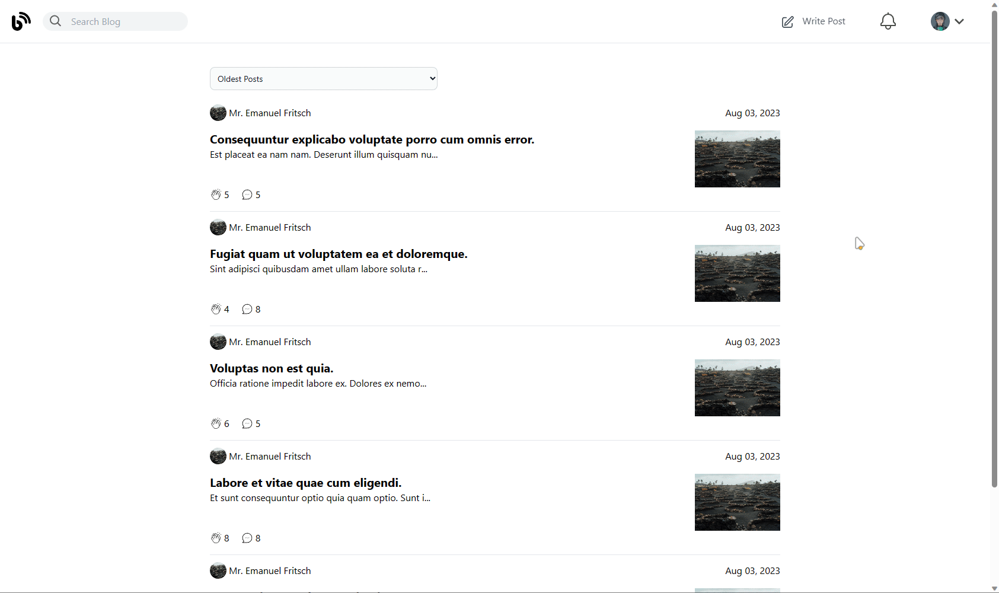
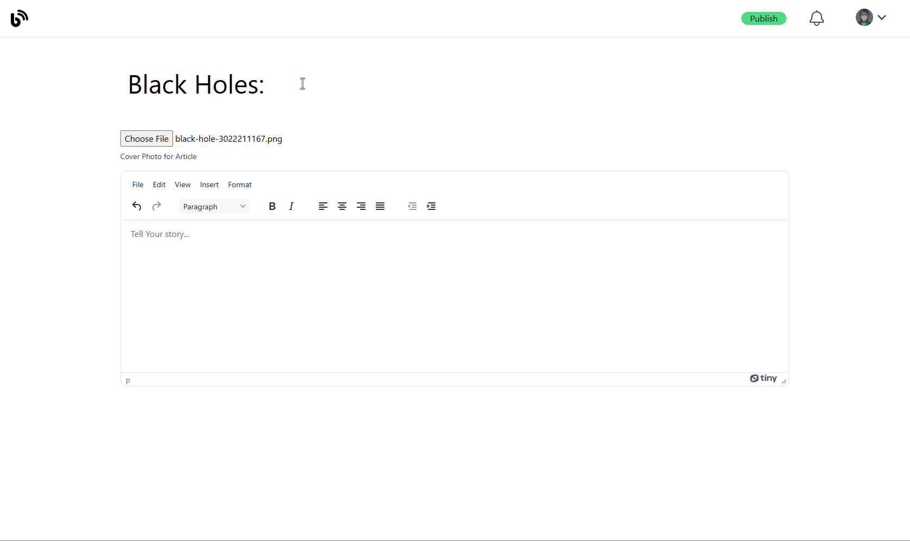

# Codeplex - Blogging Platform

Codeplex is a simple and user-friendly Responsive blogging platform built using Laravel and Tailwind CSS. It allows users to register, log in, post their own blogs, and read blogs written by others. The platform leverages Laravel's built-in authentication system to ensure secure user registration and login.

## Features

- User Registration: New users can easily sign up for an account on Codeplex.
- User Login: Registered users can log in to access their personalized dashboard.
- Create and Publish Blogs: Authenticated users can create and publish their own blogs with ease.
- Read Blogs: Users can explore and read blogs posted by other users.

## Demo

Login Registration:


Like and Comment:


Create and Publish Blogs:


## Technologies Used

- Laravel: A powerful PHP framework for building web applications.
- Tailwind CSS: A utility-first CSS framework for building modern and responsive designs.

## How to Use

1. Clone the repository:

```bash
git clone https://github.com/your-username/codeplex.git
cd codeplex
```

2. Install dependencies:

```bash
composer install
pnpm install
```

3. Set up the database:

   - Create a new database for the project.
   - Rename the `.env.example` file to `.env` and update the database credentials.

4. Generate the application key:

```bash
php artisan key:generate
```

5. Run migrations and seed the database:

```bash
php artisan migrate --seed
```

6. Start the development server:

```bash
php artisan serve
```
6. Start the nodejs server:

```bash
pnpm dev
```

7. Visit `http://localhost:8000` in your web browser to access the Codeplex application.
